#U.S. News & World Report Presidential Campaign Tracker

*A project by  Lindsey Cook, Andrew Soergel and Dave Catanese*

We've collected data on trips by potential presidential candidates to Iowa, New Hampshire and South Carolina and have been publishing the results on our website since early August. You can see the tracker's methodology [here](http://www.usnews.com/news/blogs/data-mine/2014/08/04/tracking-trips-to-iowa-and-new-hampshire-by-presidential-candidates). We created the tracker because of a glaring lack of campaign data. Too often, data tallying for campaigns stay in the notebooks of individual reporters or need to be gathered from hundreds of news articles covering candidates on the campaign trail.

Since launching the project, we've gotten some great feedback on how helpful the data is, and have decided to open the data and our graphics to the public so they can be used on any site. Below are the embed codes for graphs off the data, which was [sourced from P2016.org](http://www.p2016.org/). Data include candidates we have targeted as being most likely to run and are updated as those candidates change. We've [recently replaced](http://www.usnews.com/news/blogs/data-mine/2014/10/14/presidential-tracker-jim-webb-and-bernie-sanders-in-john-hickenlooper-and-deval-patrick-out) Deval Patrick and John Hickenlooper with Jim Webb and Bernie Sanders.

The data are updated every week. Your graphic will automatically update after we publish the weekly update to our data. To include the data on your own website, simply copy the embed codes and paste into your website's CMS (like Wordpress). Pictures below don't necessarily reflect the most current data, but your embed code will have the most current data. So that you can see each graph in its current state, all titles are linked to a view on Tableau's site.

**Data were updated through April 27, 2015**

Note: We count Bernie Sanders as a Democrat in our data.

#Table of Contents
1. [Trips data by state and party](https://github.com/lindzcook/USNCampaignTracker#table-of-contents)
2. [Events data](https://github.com/lindzcook/USNCampaignTracker#events-data)
3. [Maps](https://github.com/lindzcook/USNCampaignTracker#maps)

The distinction between trips and events is as follows: If Bernie Sanders goes to Iowa for a week and does 8 speaking engagements, we would count that as 8 events and 1 trip.

#Trips Data
Includes the total number of trips to the three early primary states of Iowa, New Hampshire and South Carolina.

###[Trips by Party](https://public.tableausoftware.com/views/real-presidents/tripsDash?:embed=y&:display_count=no)
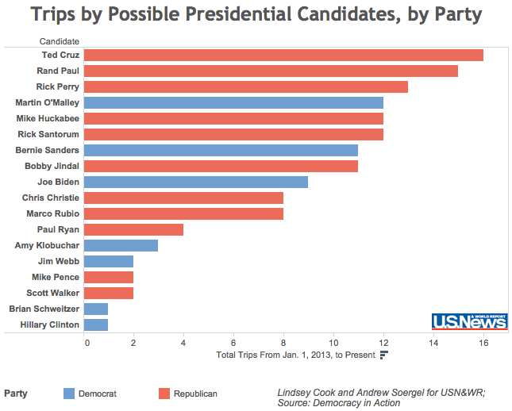

```
<script type='text/javascript' src='https://public.tableausoftware.com/javascripts/api/viz_v1.js'></script><div class='tableauPlaceholder' style='width: 656px; height: 599px;'><noscript><a href='#'></a></noscript><object class='tableauViz' width='656' height='599' style='display:none;'><param name='host_url' value='https%3A%2F%2Fpublic.tableausoftware.com%2F' /> <param name='site_root' value='' /><param name='name' value='real-presidents&#47;tripsDash' /><param name='tabs' value='no' /><param name='toolbar' value='yes' /><param name='static_image' value='https:&#47;&#47;public.tableausoftware.com&#47;static&#47;images&#47;re&#47;real-presidents&#47;tripsDash&#47;1.png' /> <param name='animate_transition' value='yes' /><param name='display_static_image' value='yes' /><param name='display_spinner' value='yes' /><param name='display_overlay' value='yes' /><param name='display_count' value='no' /></object></div><div style='width:656px;height:22px;padding:0px 10px 0px 0px;color:black;font:normal 8pt verdana,helvetica,arial,sans-serif;'><div style='float:right; padding-right:8px;'><a href='http://www.tableausoftware.com/public/about-tableau-products?ref=https://public.tableausoftware.com/views/real-presidents/tripsDash' target='_blank'></a></div></div>
```

##Iowa

###[IA Trips by Party](https://public.tableausoftware.com/views/real-presidents/iatripsdash?:embed=y&:display_count=no)
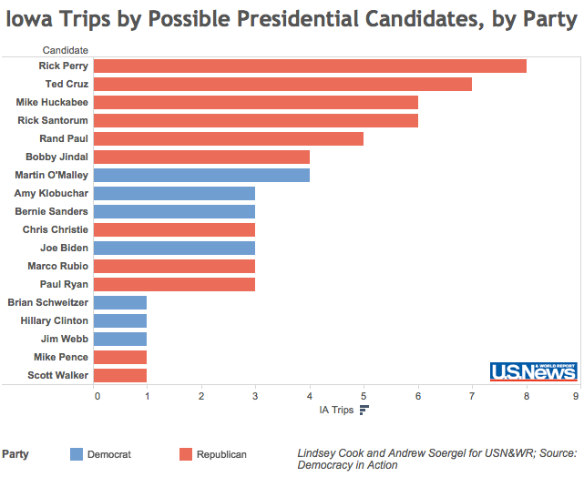

```
<script type='text/javascript' src='https://public.tableausoftware.com/javascripts/api/viz_v1.js'></script><div class='tableauPlaceholder' style='width: 656px; height: 599px;'><noscript><a href='#'></a></noscript><object class='tableauViz' width='656' height='599' style='display:none;'><param name='host_url' value='https%3A%2F%2Fpublic.tableausoftware.com%2F' /> <param name='site_root' value='' /><param name='name' value='real-presidents&#47;iatripsdash' /><param name='tabs' value='no' /><param name='toolbar' value='yes' /><param name='static_image' value='https:&#47;&#47;public.tableausoftware.com&#47;static&#47;images&#47;re&#47;real-presidents&#47;iatripsdash&#47;1.png' /> <param name='animate_transition' value='yes' /><param name='display_static_image' value='yes' /><param name='display_spinner' value='yes' /><param name='display_overlay' value='yes' /><param name='display_count' value='no' /></object></div><div style='width:656px;height:22px;padding:0px 10px 0px 0px;color:black;font:normal 8pt verdana,helvetica,arial,sans-serif;'><div style='float:right; padding-right:8px;'><a href='http://www.tableausoftware.com/public/about-tableau-products?ref=https://public.tableausoftware.com/views/real-presidents/iatripsdash' target='_blank'>/a></div></div>
```

###[IA Trips — GOP](https://public.tableausoftware.com/views/real-presidents/iowagopdash?:embed=y&:display_count=no)
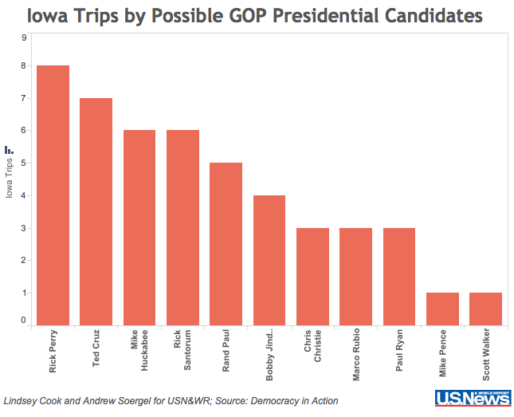

```
<script type='text/javascript' src='https://public.tableausoftware.com/javascripts/api/viz_v1.js'></script><div class='tableauPlaceholder' style='width: 656px; height: 599px;'><noscript><a href='#'></a></noscript><object class='tableauViz' width='656' height='599' style='display:none;'><param name='host_url' value='https%3A%2F%2Fpublic.tableausoftware.com%2F' /> <param name='site_root' value='' /><param name='name' value='real-presidents&#47;iowagopdash' /><param name='tabs' value='no' /><param name='toolbar' value='yes' /><param name='static_image' value='https:&#47;&#47;public.tableausoftware.com&#47;static&#47;images&#47;re&#47;real-presidents&#47;iowagopdash&#47;1.png' /> <param name='animate_transition' value='yes' /><param name='display_static_image' value='yes' /><param name='display_spinner' value='yes' /><param name='display_overlay' value='yes' /><param name='display_count' value='no' /></object></div><div style='width:656px;height:22px;padding:0px 10px 0px 0px;color:black;font:normal 8pt verdana,helvetica,arial,sans-serif;'><div style='float:right; padding-right:8px;'><a href='http://www.tableausoftware.com/public/about-tableau-products?ref=https://public.tableausoftware.com/views/real-presidents/iowagopdash' target='_blank'></a></div></div>
```

###[IA Trips — Democrats](https://public.tableausoftware.com/views/real-presidents/iowademdash?:embed=y&:display_count=no)
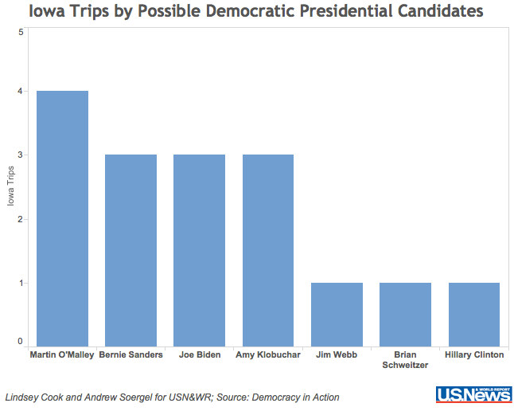

```
<script type='text/javascript' src='https://public.tableausoftware.com/javascripts/api/viz_v1.js'></script><div class='tableauPlaceholder' style='width: 656px; height: 599px;'><noscript><a href='#'></a></noscript><object class='tableauViz' width='656' height='599' style='display:none;'><param name='host_url' value='https%3A%2F%2Fpublic.tableausoftware.com%2F' /> <param name='site_root' value='' /><param name='name' value='real-presidents&#47;iowademdash' /><param name='tabs' value='no' /><param name='toolbar' value='yes' /><param name='static_image' value='https:&#47;&#47;public.tableausoftware.com&#47;static&#47;images&#47;re&#47;real-presidents&#47;iowademdash&#47;1.png' /> <param name='animate_transition' value='yes' /><param name='display_static_image' value='yes' /><param name='display_spinner' value='yes' /><param name='display_overlay' value='yes' /><param name='display_count' value='no' /></object></div><div style='width:656px;height:22px;padding:0px 10px 0px 0px;color:black;font:normal 8pt verdana,helvetica,arial,sans-serif;'><div style='float:right; padding-right:8px;'><a href='http://www.tableausoftware.com/public/about-tableau-products?ref=https://public.tableausoftware.com/views/real-presidents/iowademdash' target='_blank'></a></div></div>
```


##New Hampshire
###[NH Trips by Party](https://public.tableausoftware.com/views/real-presidents/nhtripsdash?:embed=y&:display_count=no)
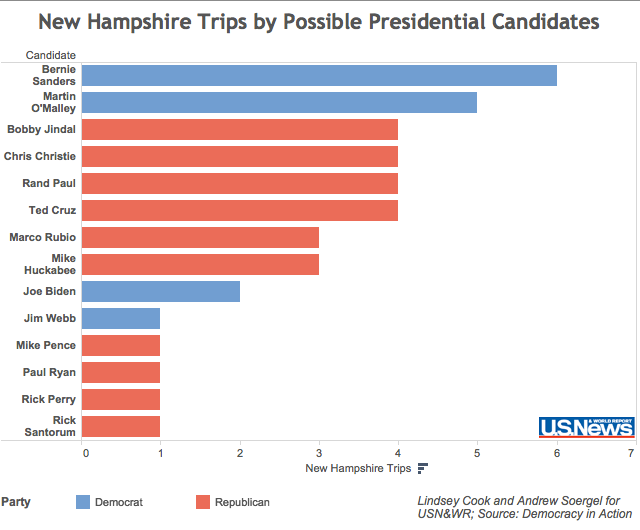

```
<script type='text/javascript' src='https://public.tableausoftware.com/javascripts/api/viz_v1.js'></script><div class='tableauPlaceholder' style='width: 656px; height: 599px;'><noscript><a href='#'></a></noscript><object class='tableauViz' width='656' height='599' style='display:none;'><param name='host_url' value='https%3A%2F%2Fpublic.tableausoftware.com%2F' /> <param name='site_root' value='' /><param name='name' value='real-presidents&#47;nhtripsdash' /><param name='tabs' value='no' /><param name='toolbar' value='yes' /><param name='static_image' value='https:&#47;&#47;public.tableausoftware.com&#47;static&#47;images&#47;re&#47;real-presidents&#47;nhtripsdash&#47;1.png' /> <param name='animate_transition' value='yes' /><param name='display_static_image' value='yes' /><param name='display_spinner' value='yes' /><param name='display_overlay' value='yes' /><param name='display_count' value='no' /></object></div><div style='width:656px;height:22px;padding:0px 10px 0px 0px;color:black;font:normal 8pt verdana,helvetica,arial,sans-serif;'><div style='float:right; padding-right:8px;'><a href='http://www.tableausoftware.com/public/about-tableau-products?ref=https://public.tableausoftware.com/views/real-presidents/nhtripsdash' target='_blank'></a></div></div>
```

###[NH Trips — GOP](https://public.tableausoftware.com/views/real-presidents/nhgopdash?:embed=y&:display_count=no)
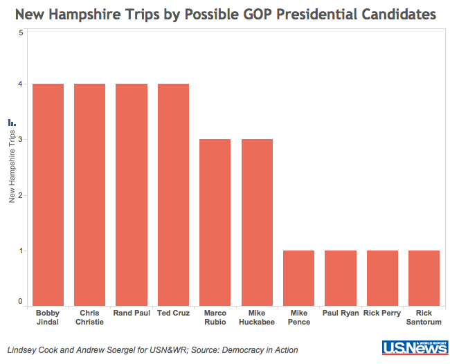

```
<script type='text/javascript' src='https://public.tableausoftware.com/javascripts/api/viz_v1.js'></script><div class='tableauPlaceholder' style='width: 656px; height: 599px;'><noscript><a href='#'></a></noscript><object class='tableauViz' width='656' height='599' style='display:none;'><param name='host_url' value='https%3A%2F%2Fpublic.tableausoftware.com%2F' /> <param name='site_root' value='' /><param name='name' value='real-presidents&#47;nhgopdash' /><param name='tabs' value='no' /><param name='toolbar' value='yes' /><param name='static_image' value='https:&#47;&#47;public.tableausoftware.com&#47;static&#47;images&#47;re&#47;real-presidents&#47;nhgopdash&#47;1.png' /> <param name='animate_transition' value='yes' /><param name='display_static_image' value='yes' /><param name='display_spinner' value='yes' /><param name='display_overlay' value='yes' /><param name='display_count' value='no' /></object></div><div style='width:656px;height:22px;padding:0px 10px 0px 0px;color:black;font:normal 8pt verdana,helvetica,arial,sans-serif;'><div style='float:right; padding-right:8px;'><a href='http://www.tableausoftware.com/public/about-tableau-products?ref=https://public.tableausoftware.com/views/real-presidents/nhgopdash' target='_blank'></a></div></div>
```

###[NH Trips — Democrats](https://public.tableausoftware.com/views/real-presidents/nhdemsdash?:embed=y&:display_count=no)
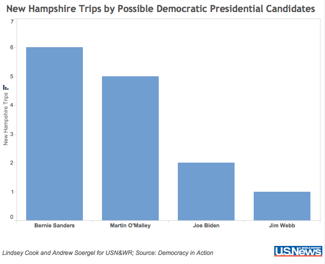

```
<script type='text/javascript' src='https://public.tableausoftware.com/javascripts/api/viz_v1.js'></script><div class='tableauPlaceholder' style='width: 656px; height: 599px;'><noscript><a href='#'></a></noscript><object class='tableauViz' width='656' height='599' style='display:none;'><param name='host_url' value='https%3A%2F%2Fpublic.tableausoftware.com%2F' /> <param name='site_root' value='' /><param name='name' value='real-presidents&#47;nhdemsdash' /><param name='tabs' value='no' /><param name='toolbar' value='yes' /><param name='static_image' value='https:&#47;&#47;public.tableausoftware.com&#47;static&#47;images&#47;re&#47;real-presidents&#47;nhdemsdash&#47;1.png' /> <param name='animate_transition' value='yes' /><param name='display_static_image' value='yes' /><param name='display_spinner' value='yes' /><param name='display_overlay' value='yes' /><param name='display_count' value='no' /></object></div><div style='width:656px;height:22px;padding:0px 10px 0px 0px;color:black;font:normal 8pt verdana,helvetica,arial,sans-serif;'><div style='float:right; padding-right:8px;'><a href='http://www.tableausoftware.com/public/about-tableau-products?ref=https://public.tableausoftware.com/views/real-presidents/nhdemsdash' target='_blank'></a></div></div>
```

##South Carolina
###[SC Trips by Party](https://public.tableausoftware.com/views/real-presidents/Sctripsdash?:embed=y&:display_count=no)
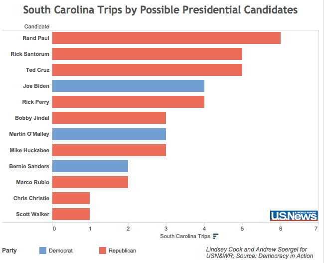

```
<script type='text/javascript' src='https://public.tableausoftware.com/javascripts/api/viz_v1.js'></script><div class='tableauPlaceholder' style='width: 656px; height: 599px;'><noscript><a href='#'></a></noscript><object class='tableauViz' width='656' height='599' style='display:none;'><param name='host_url' value='https%3A%2F%2Fpublic.tableausoftware.com%2F' /> <param name='site_root' value='' /><param name='name' value='real-presidents&#47;Sctripsdash' /><param name='tabs' value='no' /><param name='toolbar' value='yes' /><param name='static_image' value='https:&#47;&#47;public.tableausoftware.com&#47;static&#47;images&#47;re&#47;real-presidents&#47;Sctripsdash&#47;1.png' /> <param name='animate_transition' value='yes' /><param name='display_static_image' value='yes' /><param name='display_spinner' value='yes' /><param name='display_overlay' value='yes' /><param name='display_count' value='no' /></object></div><div style='width:656px;height:22px;padding:0px 10px 0px 0px;color:black;font:normal 8pt verdana,helvetica,arial,sans-serif;'><div style='float:right; padding-right:8px;'><a href='http://www.tableausoftware.com/public/about-tableau-products?ref=https://public.tableausoftware.com/views/real-presidents/Sctripsdash' target='_blank'>/a></div></div>
```

###[SC Trips — GOP](https://public.tableausoftware.com/views/real-presidents/scgopdash?:embed=y&:display_count=no)
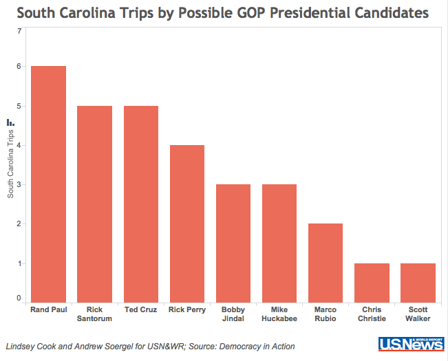

```
<script type='text/javascript' src='https://public.tableausoftware.com/javascripts/api/viz_v1.js'></script><div class='tableauPlaceholder' style='width: 656px; height: 599px;'><noscript><a href='#'></a></noscript><object class='tableauViz' width='656' height='599' style='display:none;'><param name='host_url' value='https%3A%2F%2Fpublic.tableausoftware.com%2F' /> <param name='site_root' value='' /><param name='name' value='real-presidents&#47;scgopdash' /><param name='tabs' value='no' /><param name='toolbar' value='yes' /><param name='static_image' value='https:&#47;&#47;public.tableausoftware.com&#47;static&#47;images&#47;re&#47;real-presidents&#47;scgopdash&#47;1.png' /> <param name='animate_transition' value='yes' /><param name='display_static_image' value='yes' /><param name='display_spinner' value='yes' /><param name='display_overlay' value='yes' /><param name='display_count' value='no' /></object></div><div style='width:656px;height:22px;padding:0px 10px 0px 0px;color:black;font:normal 8pt verdana,helvetica,arial,sans-serif;'><div style='float:right; padding-right:8px;'><a href='http://www.tableausoftware.com/public/about-tableau-products?ref=https://public.tableausoftware.com/views/real-presidents/scgopdash' target='_blank'></a></div></div>
```

###[SC Trips — Democrats](https://public.tableausoftware.com/views/real-presidents/scdemdash?:embed=y&:display_count=no)
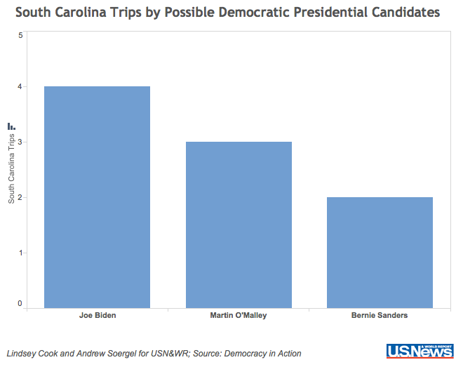

```
<script type='text/javascript' src='https://public.tableausoftware.com/javascripts/api/viz_v1.js'></script><div class='tableauPlaceholder' style='width: 656px; height: 599px;'><noscript><a href='#'></a></noscript><object class='tableauViz' width='656' height='599' style='display:none;'><param name='host_url' value='https%3A%2F%2Fpublic.tableausoftware.com%2F' /> <param name='site_root' value='' /><param name='name' value='real-presidents&#47;scdemdash' /><param name='tabs' value='no' /><param name='toolbar' value='yes' /><param name='static_image' value='https:&#47;&#47;public.tableausoftware.com&#47;static&#47;images&#47;re&#47;real-presidents&#47;scdemdash&#47;1.png' /> <param name='animate_transition' value='yes' /><param name='display_static_image' value='yes' /><param name='display_spinner' value='yes' /><param name='display_overlay' value='yes' /><param name='display_count' value='no' /></object></div><div style='width:656px;height:22px;padding:0px 10px 0px 0px;color:black;font:normal 8pt verdana,helvetica,arial,sans-serif;'><div style='float:right; padding-right:8px;'><a href='http://www.tableausoftware.com/public/about-tableau-products?ref=https://public.tableausoftware.com/views/real-presidents/scdemdash' target='_blank'></a></div></div>
```


#Events Data

###[Timeline](https://public.tableausoftware.com/views/real-presidents/timelinedash?:embed=y&:display_count=no)
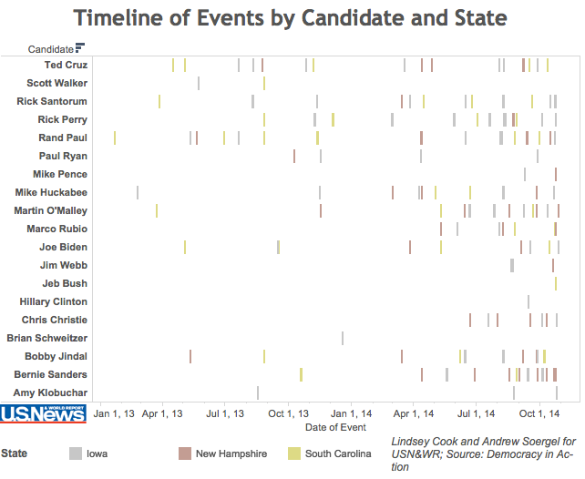

```
<script type='text/javascript' src='https://public.tableausoftware.com/javascripts/api/viz_v1.js'></script><div class='tableauPlaceholder' style='width: 656px; height: 599px;'><noscript><a href='#'></a></noscript><object class='tableauViz' width='656' height='599' style='display:none;'><param name='host_url' value='https%3A%2F%2Fpublic.tableausoftware.com%2F' /> <param name='site_root' value='' /><param name='name' value='real-presidents&#47;timelinedash' /><param name='tabs' value='no' /><param name='toolbar' value='yes' /><param name='static_image' value='https:&#47;&#47;public.tableausoftware.com&#47;static&#47;images&#47;re&#47;real-presidents&#47;timelinedash&#47;1.png' /> <param name='animate_transition' value='yes' /><param name='display_static_image' value='yes' /><param name='display_spinner' value='yes' /><param name='display_overlay' value='yes' /><param name='display_count' value='no' /></object></div><div style='width:656px;height:22px;padding:0px 10px 0px 0px;color:black;font:normal 8pt verdana,helvetica,arial,sans-serif;'><div style='float:right; padding-right:8px;'><a href='http://www.tableausoftware.com/public/about-tableau-products?ref=https://public.tableausoftware.com/views/real-presidents/timelinedash' target='_blank'></a></div></div>
```

###[Events by Party](https://public.tableausoftware.com/views/real-presidents/eventsdash?:embed=y&:display_count=no)
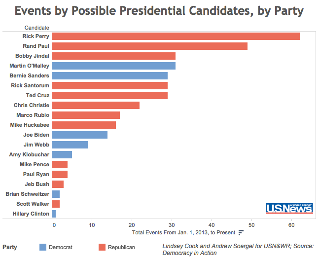

```
<script type='text/javascript' src='https://public.tableausoftware.com/javascripts/api/viz_v1.js'></script><div class='tableauPlaceholder' style='width: 656px; height: 599px;'><noscript><a href='#'></a></noscript><object class='tableauViz' width='656' height='599' style='display:none;'><param name='host_url' value='https%3A%2F%2Fpublic.tableausoftware.com%2F' /> <param name='site_root' value='' /><param name='name' value='real-presidents&#47;eventsdash' /><param name='tabs' value='no' /><param name='toolbar' value='yes' /><param name='static_image' value='https:&#47;&#47;public.tableausoftware.com&#47;static&#47;images&#47;re&#47;real-presidents&#47;eventsdash&#47;1.png' /> <param name='animate_transition' value='yes' /><param name='display_static_image' value='yes' /><param name='display_spinner' value='yes' /><param name='display_overlay' value='yes' /><param name='display_count' value='no' /></object></div><div style='width:656px;height:22px;padding:0px 10px 0px 0px;color:black;font:normal 8pt verdana,helvetica,arial,sans-serif;'><div style='float:right; padding-right:8px;'><a href='http://www.tableausoftware.com/public/about-tableau-products?ref=https://public.tableausoftware.com/views/real-presidents/eventsdash' target='_blank'></a></div></div>
```

##Maps
To reposition the map, hold your mouse down for an awkwardly long time and then drag.

###[Big Map](https://public.tableausoftware.com/views/real-presidents/mapDash?:embed=y&:display_count=no)
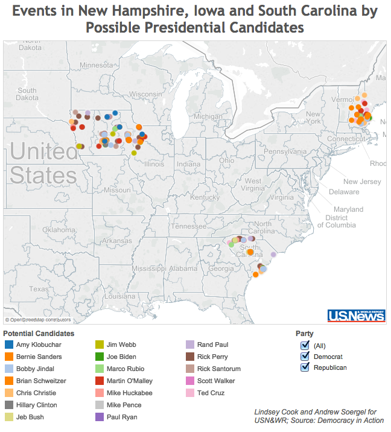

```
<script type='text/javascript' src='https://public.tableausoftware.com/javascripts/api/viz_v1.js'></script><div class='tableauPlaceholder' style='width: 656px; height: 799px;'><noscript><a href='#'></a></noscript><object class='tableauViz' width='656' height='799' style='display:none;'><param name='host_url' value='https%3A%2F%2Fpublic.tableausoftware.com%2F' /> <param name='site_root' value='' /><param name='name' value='real-presidents&#47;mapDash' /><param name='tabs' value='no' /><param name='toolbar' value='yes' /><param name='static_image' value='https:&#47;&#47;public.tableausoftware.com&#47;static&#47;images&#47;re&#47;real-presidents&#47;mapDash&#47;1.png' /> <param name='animate_transition' value='yes' /><param name='display_static_image' value='yes' /><param name='display_spinner' value='yes' /><param name='display_overlay' value='yes' /><param name='display_count' value='no' /></object></div><div style='width:656px;height:22px;padding:0px 10px 0px 0px;color:black;font:normal 8pt verdana,helvetica,arial,sans-serif;'><div style='float:right; padding-right:8px;'><a href='http://www.tableausoftware.com/public/about-tableau-products?ref=https://public.tableausoftware.com/views/real-presidents/mapDash' target='_blank'></a></div></div>
```

###[Iowa](https://public.tableausoftware.com/views/real-presidents/IADash?:embed=y&:display_count=no)
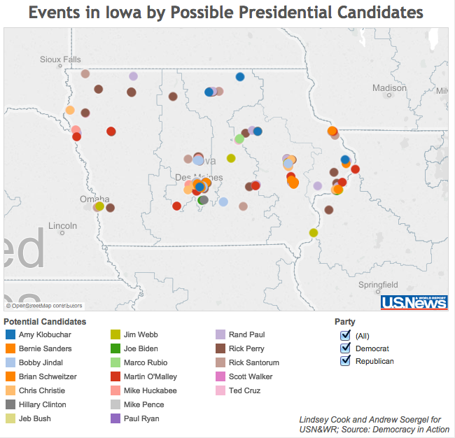

```
<script type='text/javascript' src='https://public.tableausoftware.com/javascripts/api/viz_v1.js'></script><div class='tableauPlaceholder' style='width: 656px; height: 699px;'><noscript><a href='#'></a></noscript><object class='tableauViz' width='656' height='699' style='display:none;'><param name='host_url' value='https%3A%2F%2Fpublic.tableausoftware.com%2F' /> <param name='site_root' value='' /><param name='name' value='real-presidents&#47;IADash' /><param name='tabs' value='no' /><param name='toolbar' value='yes' /><param name='static_image' value='https:&#47;&#47;public.tableausoftware.com&#47;static&#47;images&#47;re&#47;real-presidents&#47;IADash&#47;1.png' /> <param name='animate_transition' value='yes' /><param name='display_static_image' value='yes' /><param name='display_spinner' value='yes' /><param name='display_overlay' value='yes' /><param name='display_count' value='no' /></object></div><div style='width:656px;height:22px;padding:0px 10px 0px 0px;color:black;font:normal 8pt verdana,helvetica,arial,sans-serif;'><div style='float:right; padding-right:8px;'><a href='http://www.tableausoftware.com/public/about-tableau-products?ref=https://public.tableausoftware.com/views/real-presidents/IADash' target='_blank'></a></div></div>
```

###[New Hampshire](https://public.tableausoftware.com/views/real-presidents/NHdash?:embed=y&:display_count=no)
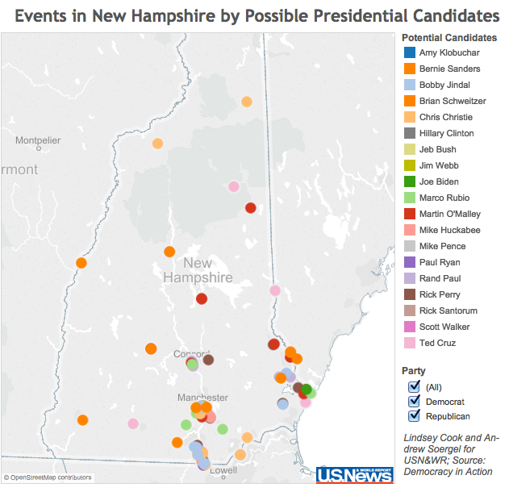

```
<script type='text/javascript' src='https://public.tableausoftware.com/javascripts/api/viz_v1.js'></script><div class='tableauPlaceholder' style='width: 656px; height: 699px;'><noscript><a href='#'></a></noscript><object class='tableauViz' width='656' height='699' style='display:none;'><param name='host_url' value='https%3A%2F%2Fpublic.tableausoftware.com%2F' /> <param name='site_root' value='' /><param name='name' value='real-presidents&#47;NHdash' /><param name='tabs' value='no' /><param name='toolbar' value='yes' /><param name='static_image' value='https:&#47;&#47;public.tableausoftware.com&#47;static&#47;images&#47;re&#47;real-presidents&#47;NHdash&#47;1.png' /> <param name='animate_transition' value='yes' /><param name='display_static_image' value='yes' /><param name='display_spinner' value='yes' /><param name='display_overlay' value='yes' /><param name='display_count' value='no' /></object></div><div style='width:656px;height:22px;padding:0px 10px 0px 0px;color:black;font:normal 8pt verdana,helvetica,arial,sans-serif;'><div style='float:right; padding-right:8px;'><a href='http://www.tableausoftware.com/public/about-tableau-products?ref=https://public.tableausoftware.com/views/real-presidents/NHdash' target='_blank'></a></div></div>
```

###[South Carolina](https://public.tableausoftware.com/views/real-presidents/SCdash?:embed=y&:display_count=no)
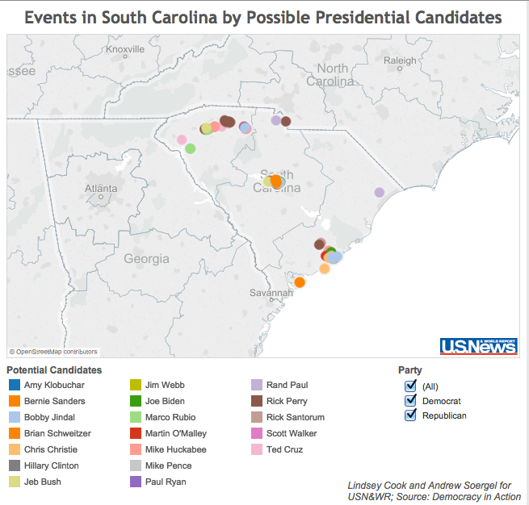

```
<script type='text/javascript' src='https://public.tableausoftware.com/javascripts/api/viz_v1.js'></script><div class='tableauPlaceholder' style='width: 656px; height: 699px;'><noscript><a href='#'></a></noscript><object class='tableauViz' width='656' height='699' style='display:none;'><param name='host_url' value='https%3A%2F%2Fpublic.tableausoftware.com%2F' /> <param name='site_root' value='' /><param name='name' value='real-presidents&#47;SCdash' /><param name='tabs' value='no' /><param name='toolbar' value='yes' /><param name='static_image' value='https:&#47;&#47;public.tableausoftware.com&#47;static&#47;images&#47;re&#47;real-presidents&#47;SCdash&#47;1.png' /> <param name='animate_transition' value='yes' /><param name='display_static_image' value='yes' /><param name='display_spinner' value='yes' /><param name='display_overlay' value='yes' /><param name='display_count' value='no' /></object></div><div style='width:656px;height:22px;padding:0px 10px 0px 0px;color:black;font:normal 8pt verdana,helvetica,arial,sans-serif;'><div style='float:right; padding-right:8px;'><a href='http://www.tableausoftware.com/public/about-tableau-products?ref=https://public.tableausoftware.com/views/real-presidents/SCdash' target='_blank'></a></div></div>
```


